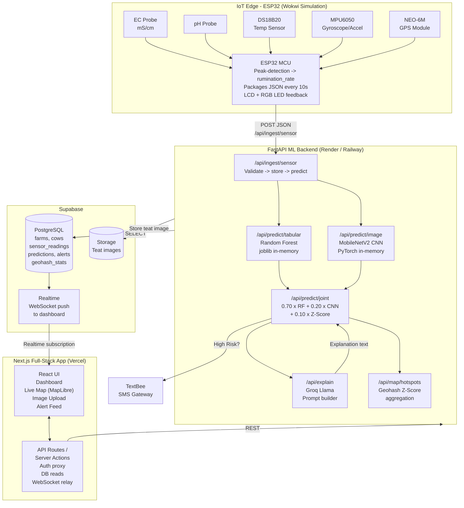
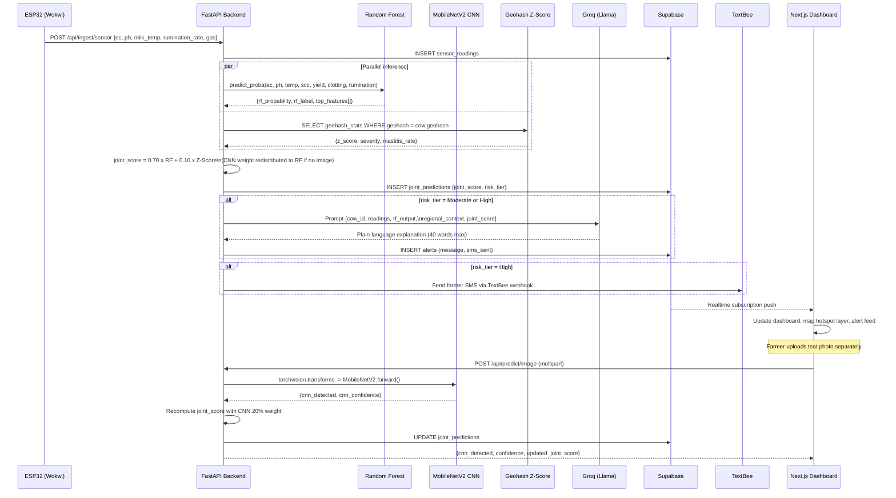
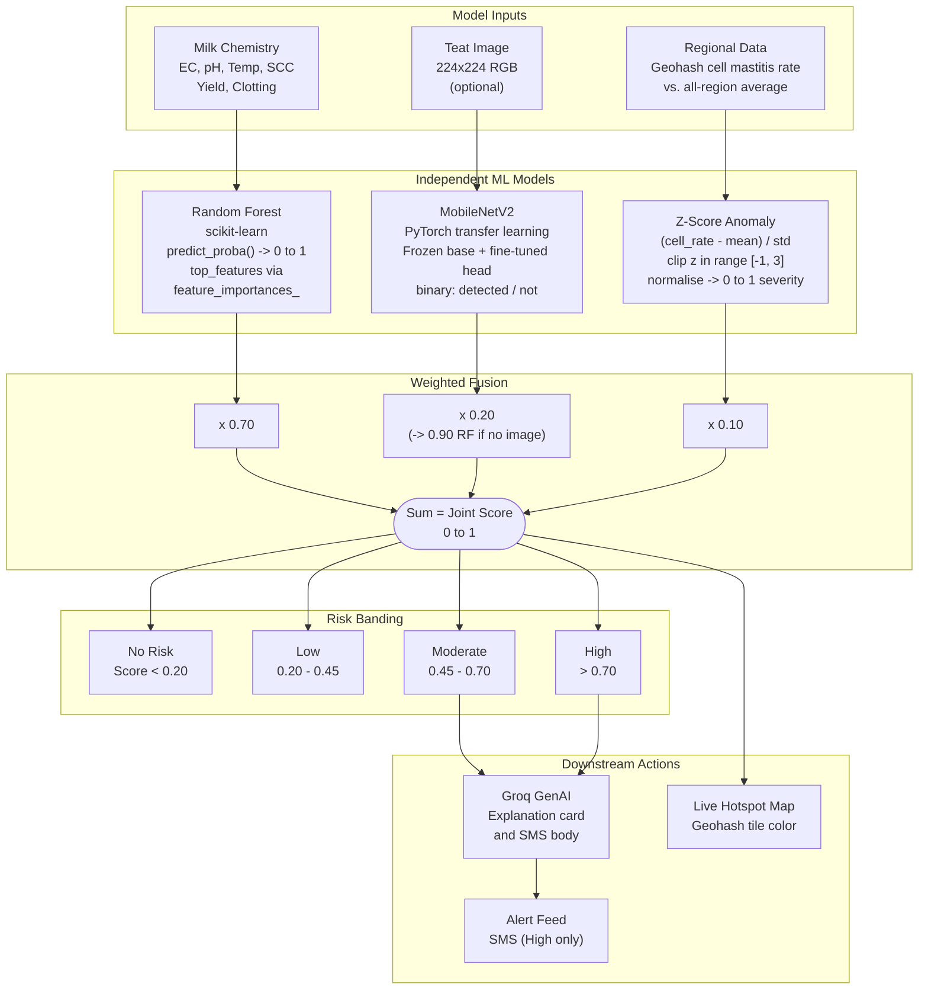
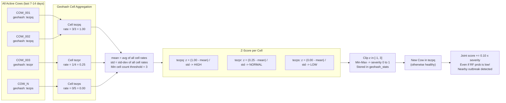
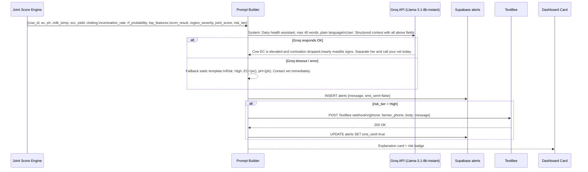
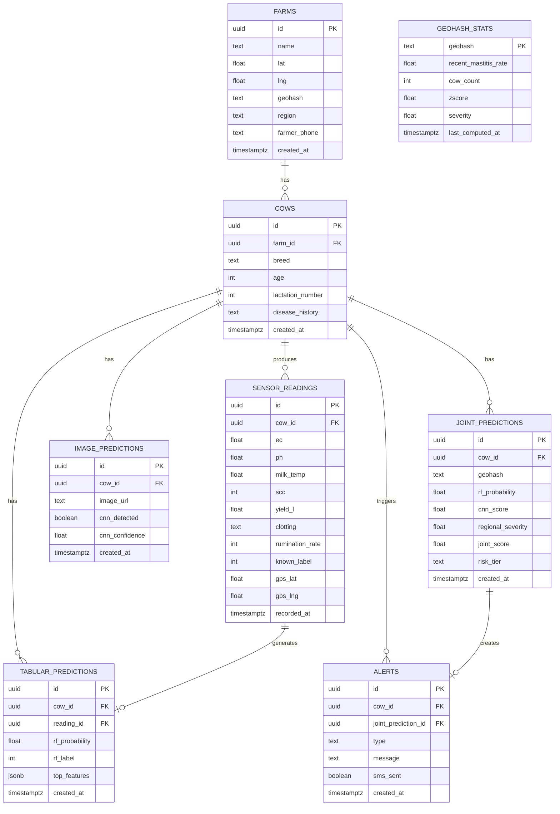

# MooSense - AI-Enabled Bovine Mastitis Forecasting System

  <!-- Frontend -->
  
  
  
  
  <!-- Backend -->
  
  
  <!-- ML -->
  
  
  <!-- AI -->
  
  <!-- Database -->
  
  
  <!-- IoT -->
  
  <!-- Maps -->
  
  <!-- Deployment -->
  
  

## Overview

MooSense is an IoT + AI system that predicts subclinical mastitis in dairy cattle **7-14 days before clinical symptoms appear**. It fuses multiple data streams -- milk sensor data, cow behaviour, teat-image classification, and time-series anomaly detection -- into a single joint risk score.

The system leverages a Generative AI layer to explain complex predictions in simple language to farmers, surfacing this through a web app with a dashboard, a live disease map, an open API, and real-time SMS alerts.

## Core ML Pillars

The prediction engine relies on **three independent models** combining to form a unified Joint Risk Score:

1. **Tabular Risk Classifier (Random Forest):** Analyzes EC, pH, milk temp, SCC, yield, coagulation, and rumination-derived activity score. Contributes **70%** of the joint score.
2. **Image-Based Detector (CNN):** PyTorch MobileNetV2 transfer-learning model that classifies teat images for visual symptoms. Contributes **20%** (redistributed to RF if no image submitted).
3. **Anomaly Detector (Z-Score):** Computes geohash-binned regional mastitis rates to identify geographical outbreaks. Contributes **10%** -- allowing a healthy-looking cow in an outbreak zone to receive an elevated risk nudge.

---

## System Architecture

---

## Data & Prediction Flow

---

## Joint Risk Score - Fusion Logic

---

## Regional Anomaly Detection - Z-Score Pipeline

---

## GenAI Explanation Pipeline

---

## Database Schema

