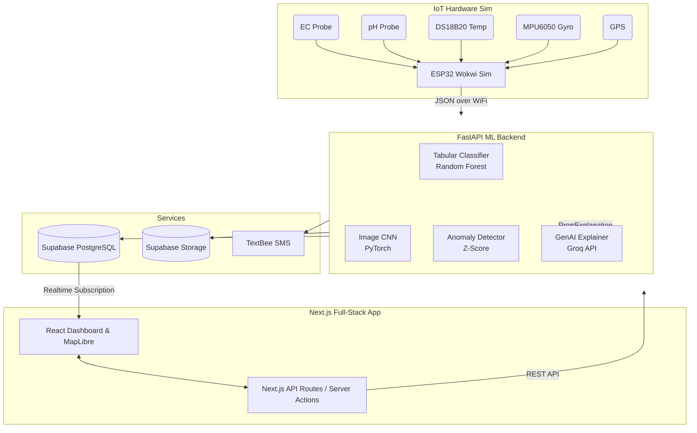
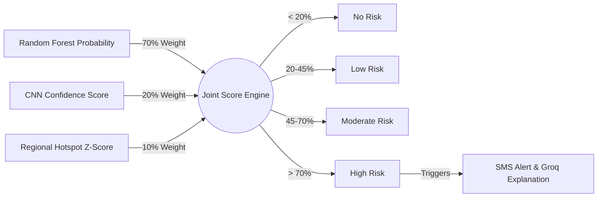

# MooSense - AI-Enabled Bovine Mastitis Forecasting System

## Overview

MooSense is an IoT + AI system that predicts subclinical mastitis in dairy cattle **7-14 days before clinical symptoms appear**. It fuses multiple data streams: milk sensor data, cow behavior, teat-image classification, and time-series anomaly detection into a single joint risk score. 

The system leverages a Generative AI layer to explain complex predictions in simple language to farmers, surfacing this through a web app with a dashboard, a live disease map, an open API, and real-time SMS alerts.

## System Architecture

The project is built on a highly decoupled architecture separating the UI, Machine Learning serving layer, and the Database/IoT integration.

## Core ML Pillars & Joint Score Computation

The prediction engine relies on **three models** combining to form a unified Joint Risk Score:

1. **Tabular Risk Classifier (Random Forest):** Analyzes EC, pH, milk temp, SCC, yield, coagulation, and rumination-derived activity score.
2. **Image-Based Detector (CNN):** PyTorch-based model (MobileNetV2/ResNet18) that classifies teat images for visual symptoms.
3. **Anomaly Detector (Z-Score):** Computes geohash-binned regional mastitis rates to identify geographical outbreaks.

### Joint Score Logic

The backend fuses these models into a final score:

## Technology Stack

| Component | Technology |
|---|---|
| **Frontend UI** | Next.js (React), Tailwind CSS, MapLibre GL JS, Recharts |
| **Backend API (ML)** | FastAPI (Python) |
| **Machine Learning** | scikit-learn (RandomForest), PyTorch & torchvision (CNN) |
| **Generative AI** | Groq API (Llama models) for farmer-friendly explanations |
| **Database** | Supabase (PostgreSQL, Auth, Realtime, Storage) |
| **Hardware / IoT** | Simulated ESP32 via Wokwi, MPU6050, DS18B20, Probes, NEO-6M |
| **Alerts** | TextBee (SMS Gateway) |
| **Deployment** | Vercel (Next.js), Render/Railway/Fly.io (FastAPI) |
