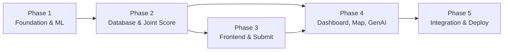

# MooSense — 5-Phase Build Plan

> Monorepo: `frontend/` (Next.js → Vercel) · `backend/` (FastAPI → Render) · root-level config  
> Design: Dark background, minimal, shadcn/ui components, no emojis  
> Datasets: 800-row tabular CSV (`class1` binary) · 602 teat images (303 mastitis / 299 normal)

---

## Monorepo Structure (Target)

```
sih/
├── frontend/                  # Next.js 14+ App Router
│   ├── app/
│   │   ├── (landing)/         # Landing page route group
│   │   │   └── page.tsx
│   │   ├── app/               # Working app (dashboard, submit, map)
│   │   │   ├── layout.tsx
│   │   │   ├── page.tsx       # Redirects to /app/submit or overview
│   │   │   ├── submit/
│   │   │   ├── dashboard/
│   │   │   └── map/
│   │   ├── layout.tsx         # Root layout (dark theme, fonts)
│   │   └── globals.css
│   ├── components/
│   │   ├── ui/                # shadcn components
│   │   ├── landing/           # Landing page sections
│   │   └── app/               # App-specific components
│   ├── lib/
│   │   ├── supabase.ts        # Supabase client
│   │   └── api.ts             # Backend API helpers
│   ├── public/
│   ├── tailwind.config.ts
│   ├── next.config.mjs
│   └── package.json
│
├── backend/                   # FastAPI (Python)
│   ├── app/
│   │   ├── main.py            # FastAPI app + CORS + startup
│   │   ├── routers/
│   │   │   ├── predict.py     # /predict/tabular, /predict/image, /predict/joint
│   │   │   ├── ingest.py      # /ingest/sensor
│   │   │   ├── cows.py        # /cows/register, /cows/{id}/history
│   │   │   ├── alerts.py      # /alerts/recent, /sms/test
│   │   │   ├── explain.py     # /explain (Groq)
│   │   │   └── map.py         # /map/hotspots
│   │   ├── models/            # ML model loading + inference
│   │   │   ├── tabular.py     # RF loader + predict
│   │   │   ├── image.py       # CNN loader + predict
│   │   │   └── joint.py       # Joint score + risk tier
│   │   ├── services/
│   │   │   ├── supabase.py    # Supabase client
│   │   │   ├── sms.py         # TextBee
│   │   │   ├── groq_llm.py    # Groq API
│   │   │   ├── cloudinary.py  # Image upload
│   │   │   └── geohash.py     # Geohash + z-score
│   │   └── core/
│   │       ├── config.py      # Environment / settings
│   │       └── schemas.py     # Pydantic models
│   ├── ml/                    # Training notebooks + saved artifacts
│   │   ├── train_rf.py        # RF training script
│   │   ├── train_cnn.py       # CNN training script
│   │   ├── artifacts/         # .joblib, .pt saved models
│   │   └── data/              # Symlinks or copies of datasets
│   ├── requirements.txt
│   ├── Dockerfile             # For Render deploy
│   └── render.yaml
│
├── datasets/                  # Raw data (gitignored, local only)
│   ├── tabular/               # cow_milk_mastitis_dataset.csv
│   └── images/                # Mastitis/ + Normal/ folders
│
├── .gitignore
├── AGENTS.md                  # Contains mastitis_project_plan.md content
├── README.md
├── phase_plan.md              # THIS FILE
└── .env.example               # All required env vars documented
```

---

## Phase 1 — Foundation & ML Pipeline
**Goal:** Monorepo scaffolded, both ML models trained and serving predictions via FastAPI, testable with `curl`.

### 1.1 Monorepo & Tooling Setup
| # | Task | Detail |
|---|------|--------|
| 1 | Create monorepo structure | `frontend/`, `backend/`, `datasets/` dirs |
| 2 | Root `.gitignore` | Node modules, `__pycache__`, `.env`, `datasets/`, `ml/artifacts/*.pt`, `*.joblib`, Wokwi files |
| 3 | Root `AGENTS.md` | Copy `mastitis_project_plan.md` content verbatim |
| 4 | Root `.env.example` | Document all env vars: `SUPABASE_URL`, `SUPABASE_KEY`, `GROQ_API_KEY`, `TEXTBEE_API_KEY`, `CLOUDINARY_*`, `FASTAPI_URL` |
| 5 | Backend Python env | `requirements.txt` — fastapi, uvicorn, scikit-learn, joblib, torch, torchvision, Pillow, python-multipart, supabase-py, httpx, python-dotenv, python-geohash |
| 6 | FastAPI skeleton | `main.py` with CORS (allow Vercel origin + localhost), health-check `GET /` endpoint, run with `uvicorn` |

### 1.2 Tabular Model (Random Forest)
| # | Task | Detail |
|---|------|--------|
| 7 | Load & preprocess CSV | Read `cow_milk_mastitis_dataset.csv` (800 rows). Note: column is `class1`, not `class`. Clean nulls. Encode `Clotting` as ordinal (0/1/2). Add `EC_pH_ratio`, `SCC_log`. |
| 8 | Train RF | `RandomForestClassifier`, split by `Cow_ID` to avoid leakage, `GridSearchCV` for hyperparams, `class_weight='balanced'` if imbalanced. |
| 9 | Save artifact | `joblib.dump()` → `backend/ml/artifacts/rf_model.joblib` + `feature_names.json` |
| 10 | Serve in FastAPI | `/api/predict/tabular` — load model at startup, accept JSON body, return `{ rf_probability, rf_label, top_features }` |
| 11 | Test with curl | Confirm valid JSON response with realistic input |

### 1.3 CNN Image Model (Transfer Learning)
| # | Task | Detail |
|---|------|--------|
| 12 | Preprocess images | Resize 224×224, normalize, augmentation (flip, rotate, brightness). Stratified 70/15/15 split. |
| 13 | Train CNN | MobileNetV2 (or ResNet18) transfer learning — frozen base, fine-tune head. PyTorch. |
| 14 | Save artifact | `torch.save()` → `backend/ml/artifacts/cnn_model.pt` |
| 15 | Serve in FastAPI | `/api/predict/image` — multipart upload, `torchvision.transforms`, return `{ detected, confidence }` |
| 16 | Test with curl | `curl -F "file=@teat.jpg"` — confirm response |

### Phase 1 Exit Criteria
- [ ] `curl POST /api/predict/tabular` returns RF probability + features
- [ ] `curl POST /api/predict/image` returns CNN verdict + confidence
- [ ] Both models load at startup, no external DB dependency yet

---

## Phase 2 — Database, Joint Score & Core Backend
**Goal:** Supabase schema live, joint score computation working, all core API endpoints functional, geohash anomaly detection operational.

### 2.1 Supabase Setup
| # | Task | Detail |
|---|------|--------|
| 17 | Create Supabase project | Free tier. Get URL + anon key + service role key. |
| 18 | Create schema | Tables: `farms`, `cows`, `sensor_readings`, `tabular_predictions`, `image_predictions`, `geohash_stats`, `joint_predictions`, `alerts` — as per plan Section 9 |
| 19 | Backend Supabase client | `supabase-py` client in `services/supabase.py`, env-driven config |
| 20 | RLS policies | Basic: anon read on `cows`, `farms`, `joint_predictions`, `alerts` for dashboard queries. Service role for inserts. |

### 2.2 Cow & Farm Registration
| # | Task | Detail |
|---|------|--------|
| 21 | `/api/cows/register` | POST — creates cow + farm record, captures `farmer_phone`. Stores `geohash` from GPS. |
| 22 | `/api/cows/{cow_id}/history` | GET — returns time-series readings + all prediction sub-scores for a cow |

### 2.3 Joint Score & Anomaly Detection
| # | Task | Detail |
|---|------|--------|
| 23 | Geohash service | `services/geohash.py` — compute geohash from lat/lng, query `geohash_stats`, compute z-score, return severity (0–1) |
| 24 | Joint score computation | `models/joint.py` — `joint_score = 0.70*rf + 0.20*cnn + 0.10*anomaly`. Handle missing CNN (redistribute weight). Risk tier banding. |
| 25 | `/api/predict/joint` | POST — computes/stores full joint prediction. Writes to `joint_predictions` table. |
| 26 | `/api/map/hotspots` | GET — returns geohash-binned stats (rate, z-score, severity, cow count) as GeoJSON |
| 27 | `/api/ingest/sensor` | POST — receives ESP32-style JSON, stores in `sensor_readings`, runs RF + joint score, returns risk tier |

### 2.4 Seed Demo Data
| # | Task | Detail |
|---|------|--------|
| 28 | Seed script | Python script to insert 8–10 farms across 3–4 geohash cells, 20+ cows with varied risk profiles, one geohash cell pre-seeded as "outbreak zone" |

### Phase 2 Exit Criteria
- [ ] All tables created in Supabase with sample data
- [ ] `/api/predict/joint` returns joint score + risk tier
- [ ] `/api/map/hotspots` returns valid GeoJSON with z-scores
- [ ] `/api/ingest/sensor` stores data + triggers prediction pipeline
- [ ] Seeded demo data shows clear outbreak zone in one geohash cell

---

## Phase 3 — Frontend: Landing Page & Submit Data Section
**Goal:** Next.js app scaffolded with dark theme + shadcn, landing page live, Submit Data section functional with both independent cards.

### 3.1 Next.js Scaffold
| # | Task | Detail |
|---|------|--------|
| 29 | `create-next-app` | Inside `frontend/`. App Router, TypeScript, Tailwind, `src/` disabled (use `app/` at root of frontend). |
| 30 | Install shadcn/ui | `npx shadcn@latest init` — dark theme default. Install: `button`, `card`, `input`, `label`, `badge`, `table`, `tabs`, `dialog`, `separator`, `select`, `toast` |
| 31 | Dark theme setup | `globals.css` — dark background (`zinc-950` / `neutral-950`), muted borders, no emojis anywhere. Clean Inter/Geist font. |
| 32 | API helper | `lib/api.ts` — typed fetch wrappers for backend endpoints (base URL from env: `NEXT_PUBLIC_API_URL`) |

### 3.2 Landing Page (`/`)
| # | Task | Detail |
|---|------|--------|
| 33 | Hero section | Project name "MooSense", one-line pitch, prominent "Enter MooSense" button → `/app/submit`. Minimal, dark, clean. |
| 34 | Problem section | Subclinical mastitis stats, economic impact, AMR angle. Short. Use shadcn `Card` for stat blocks. |
| 35 | How it works section | 3–4 step visual: Sensor → AI Analysis → Risk Alert → Action. Use shadcn icons (Lucide) instead of emojis. |
| 36 | Tech/features section | Brief grid of capabilities: Real-time monitoring, Image analysis, Regional hotspot, SMS alerts. Lucide icons. |
| 37 | Footer | Minimal. Project name, "Built for SIH" line. |

### 3.3 App Layout (`/app`)
| # | Task | Detail |
|---|------|--------|
| 38 | App layout | Sidebar or top nav with tabs: Submit / Dashboard / Map. Dark, minimal. shadcn `Tabs` or sidebar component. |
| 39 | Auth placeholder | Simple placeholder for now (you said you'll explain later). Just a wrapper that can gate `/app/*` routes later. |

### 3.4 Submit Data Section (`/app/submit`)
| # | Task | Detail |
|---|------|--------|
| 40 | Card A: Tabular submission | Form: cow_id (select/create), EC, pH, milk temp, SCC, yield, clotting (dropdown), rumination rate, known_label (0/1 optional). Submit → call `/api/predict/tabular` → show result inline: RF probability badge, binary verdict, top 3 features bar. |
| 41 | Card B: Image submission | cow_id selector, drag-drop image upload, optional GPS. Submit → call `/api/predict/image` → show CNN verdict + confidence inline. |
| 42 | Phone capture | Inline field on first cow/farm registration. Stores via `/api/cows/register`. Hidden once saved. |
| 43 | Loading states | shadcn `Skeleton` during API calls, `Toast` for errors. |

### Phase 3 Exit Criteria
- [ ] Landing page loads on `localhost:3000`, dark themed, clean, no emojis
- [ ] "Enter MooSense" navigates to `/app/submit`
- [ ] Card A submits to backend → shows RF result
- [ ] Card B submits image to backend → shows CNN result
- [ ] Both cards work independently (can submit one without the other)

---

## Phase 4 — Dashboard, Map, Alerts & GenAI
**Goal:** Full dashboard with herd table + cow detail, live MapLibre map with hotspots, Groq explanation layer, SMS alerts firing end-to-end.

### 4.1 Dashboard (`/app/dashboard`)
| # | Task | Detail |
|---|------|--------|
| 44 | Herd table | shadcn `Table` — all cows, joint risk badge (color-coded: green/yellow/orange/red), last updated, sub-scores. Sortable by risk. |
| 45 | Cow detail view | Click row → drawer/page: trend line chart (Recharts — EC/pH/temp over days), RF + CNN + anomaly sub-scores, joint score breakdown (small stacked bar showing 70/20/10 weights), GenAI explanation card. |
| 46 | Trend charts | Recharts line charts. Dark theme consistent. Minimal axis labels. |
| 47 | Real-time updates | Supabase Realtime subscription on `joint_predictions` + `alerts` — table updates without manual refresh. |

### 4.2 Live Map (`/app/map`)
| # | Task | Detail |
|---|------|--------|
| 48 | MapLibre setup | `maplibre-gl` + free tiles (OpenFreeMap). Dark map style. |
| 49 | Farm/cow markers | GeoJSON layer, colored by joint risk tier. Cluster when dense. Click → popup: cow ID, risk tier, timestamp. |
| 50 | Hotspot heatmap | Fetch `/api/map/hotspots` → heatmap/circle layer over geohash cells by severity. |
| 51 | Regional ranking panel | Side panel: "Top regions by incidence" — ranked list of geohash cells by z-score. |
| 52 | Live feed panel | Real-time scrolling list of recent alerts (Supabase Realtime on `alerts` inserts). Shows cow ID, risk, timestamp, SMS status. |

### 4.3 GenAI Explanation (Groq)
| # | Task | Detail |
|---|------|--------|
| 53 | Groq service | `services/groq_llm.py` — calls Groq API with structured prompt (plan Section 7). Uses `llama-3.1-8b-instant` or latest fast model. |
| 54 | `/api/explain` endpoint | Accepts joint score + features + regional context → returns plain-language explanation. |
| 55 | Fallback | If Groq fails/times out → return static template: "ALERT: Cow {id} shows {tier} risk. Primary factors: {features}." |
| 56 | Wire into pipeline | After joint score is computed (Moderate/High), call explain → store in `alerts.message`. |

### 4.4 SMS Alerts (TextBee)
| # | Task | Detail |
|---|------|--------|
| 57 | TextBee service | `services/sms.py` — sends SMS via TextBee API to farmer's registered phone. |
| 58 | Auto-trigger | When joint score crosses High Risk → call Groq → send GenAI message as SMS body → log in `alerts` (sms_sent boolean). |
| 59 | `/api/sms/test` | Manual trigger endpoint for demo. |

### Phase 4 Exit Criteria
- [ ] Dashboard shows herd table with real data, cow detail with charts
- [ ] Map renders with markers colored by risk, hotspot overlay visible
- [ ] Live feed updates in real-time when new predictions land
- [ ] Groq generates farmer-friendly explanation for flagged cows
- [ ] SMS fires on High Risk (testable via `/api/sms/test`)

---

## Phase 5 — Integration, Polish & Deploy
**Goal:** Everything connected end-to-end, ESP32 sim streaming, demo-ready, deployed to Vercel + Render.

### 5.1 ESP32 / Wokwi Simulation
| # | Task | Detail |
|---|------|--------|
| 60 | Wokwi circuit | ESP32 + potentiometers (EC, pH) + DS18B20 + MPU6050 + GPS module. Wokwi project link. |
| 61 | Firmware | Arduino/C++ — reads sensors, packages JSON, POSTs to `/api/ingest/sensor`. LCD shows values, LED shows risk color on response. |
| 62 | Demo script | Pre-configured sensor values that cycle through normal → deteriorating → high risk over ~60 seconds. |

### 5.2 End-to-End Integration
| # | Task | Detail |
|---|------|--------|
| 63 | Full pipeline test | Wokwi → `/ingest/sensor` → RF → joint score → Groq explain → SMS → dashboard update → map marker update. All without page refresh. |
| 64 | Regional anomaly demo | Submit normal cow into outbreak geohash → watch joint score elevate from regional term alone. |
| 65 | Curl demo commands | Prepare ready-to-paste `curl` commands for judges (tabular + image endpoints). Put in `README.md`. |

### 5.3 Authentication (Simple)
| # | Task | Detail |
|---|------|--------|
| 66 | Auth gate | Whatever simple auth approach you decide — placeholder is ready from Phase 3. Wire it to gate `/app/*` routes. (Details TBD per your later instructions.) |

### 5.4 Deployment
| # | Task | Detail |
|---|------|--------|
| 67 | Backend → Render | `Dockerfile` or `render.yaml`. Load `.pt` and `.joblib` at startup. Set env vars. Free tier. |
| 68 | Frontend → Vercel | Connect repo, set `frontend/` as root directory. Set `NEXT_PUBLIC_API_URL` to Render URL. |
| 69 | CORS finalize | Update FastAPI CORS to allow production Vercel domain. |
| 70 | Env vars | All secrets set in Vercel + Render dashboards. `.env.example` documents them. |

### 5.5 Polish & Demo Prep
| # | Task | Detail |
|---|------|--------|
| 71 | Seed production data | Run seed script against production Supabase. Multiple farms, outbreak zone, varied risk cows. |
| 72 | README.md | Project overview, architecture diagram, setup instructions, demo flow, curl examples, env var list. |
| 73 | Error handling | Loading skeletons, empty states, API error toasts, network failure graceful fallbacks across all frontend pages. |
| 74 | Responsive check | Landing page + app pages work on laptop screen (primary demo device). |
| 75 | Demo rehearsal | Walk through the full 8-step demo flow from plan Section 12. Time it. Fix anything that breaks. |

### Phase 5 Exit Criteria
- [ ] Production URLs live: `moosense.vercel.app` + `moosense-api.onrender.com`
- [ ] Full demo flow works end-to-end without errors
- [ ] Wokwi simulation streams data that appears on dashboard in real-time
- [ ] `curl` commands work against production API
- [ ] SMS delivers to real phone during demo

---

## Phase Dependency Map


